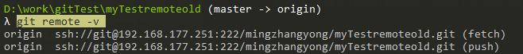

### 关于项目管理的一点想法
背景是这样的，公司的代码对于试用期的员工是不开放的。但是又需要试用期的员工干活。那要怎么样来处理这种问题呢 ？

现在的做法：
```
    老员工拉一份最新的代码，打包发给新员工。 新员工拿去开发
```

弊端显而易见。<font color=#FF0000>协作工作变得很麻烦！</font> 

老员工的代码会实时更新到git上，但是新员工没法得到更新，或者是需要靠老员工发包。

新想法：
```
    1. 新员工新建git项目、将老员工发的最新的代码上传到新建的git上
    2. 新员工在新建的git项目上开发
    3. 老员工在提交代码的时候同时提交到新员工建立的git项目里
```

如何实现一份代码同时提交到两个git项目？

假设 老员工所在的远程项目叫做 old 。

 - 新员工创建一个git项目，提供给老员工项目地址 
    ```
    ssh://git@192.168.177.251:222/mingzhangyong/myTestremotenew.git
    ```
 - 老员工在本地更新下来最新的代码
 - 本地执行 git remote -v 查看本地远程分支信息，通常类似这种

 - 然后添加一个远程地址 
    ```markdown
    git remote add originNew  ssh://git@192.168.177.251:222/mingzhangyong/myTestremotenew.git
   ```
 - 老员工执行 git pull originNew master 获取到新员工远程代码，如果报错
    ```markdown
    : refusing to merge unrelated histories
    ```
    则执行
    ```markdown
    git pull originNew master --allow-unrelated-histories
    ```
  - 老员工将本地代码推送到新员工建立的git项目上
    ```markdown
    git push originNew master
    ```
    
  - 后续新员工就在新项目上开发，老员工在需要更新的时候同时更新两个项目的代码，推送的时候也同时推送到两个项目即可
